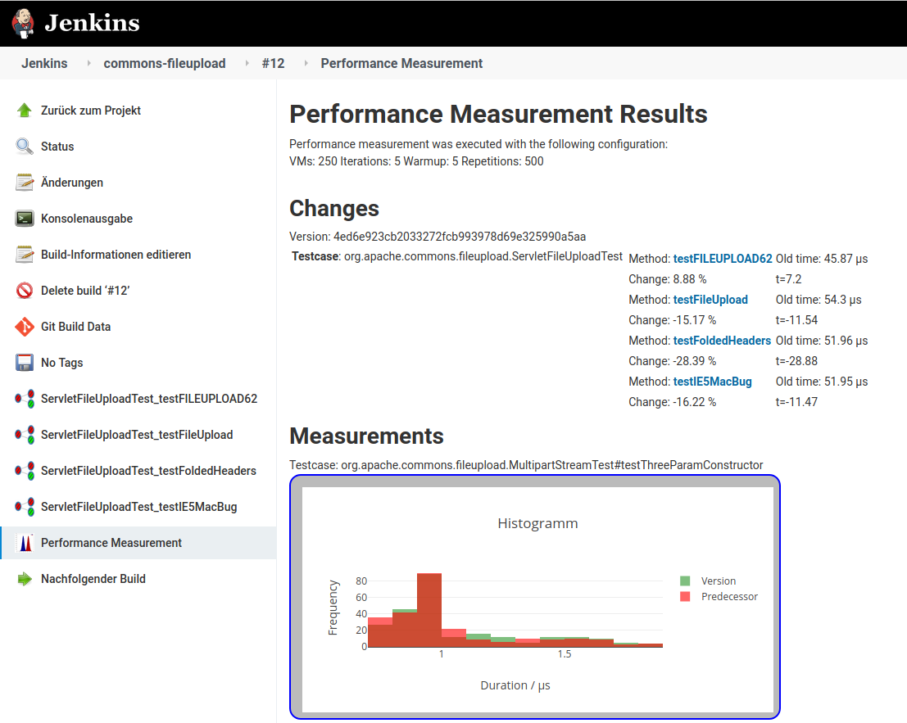
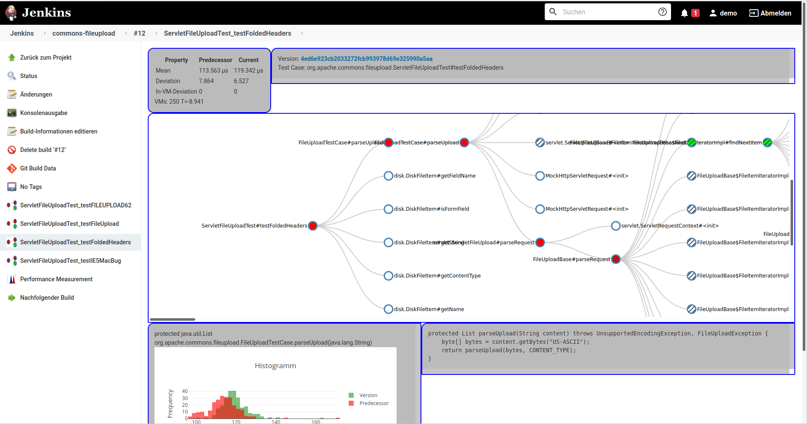
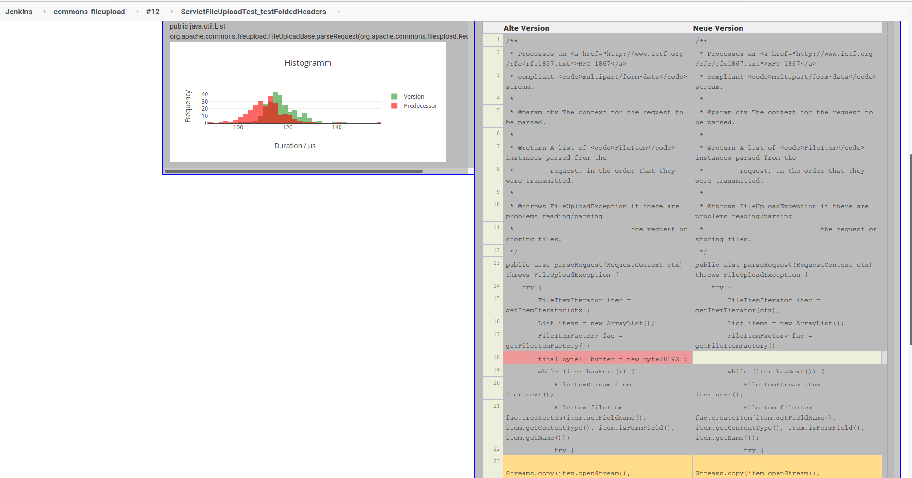

Peass-CI
===================

The Peass-CI-Plugin enables a continuous performance measurement for Java projects in an Jenkins server. By integrating Peass-CI in your build process, you will get performance measurements of each unit test and a measurement of call tree nodes, which pinpoints the root cause of your performance changes. Therefore, the following steps are executed:
- Regression Test Selection: The unit tests which may have changed performance based on the current commit will be selected by a combination of static and dynamic code analysis.
- Performance Measurement: The selected tests will be executed (repeating them inside a VM and starting the JVM, as often as you specify it) to identify performance changes.
- Root Cause Analysis: For every identified performance change, the measurement will be repeated with additional instrumentation of your call tree to identify the method call(s) which cause your performance change (optional).

Peass-CI is currently a research prototype and may not work fully. Please file issues if problems occur.

# Building

First get peass by running `git clone https://github.com/DaGeRe/peass.git && cd peass && mvn clean install -DskipTests`. Then, execute `mvn clean package`.

# Running

For testing, run `mvn hpi:run` and access `localhost:8080/jenkins`. 

For the easiest setup, get the .war-file of Jenkins (https://www.jenkins.io/download/) and run it using `java -jar jenkins.war`. Stop jenkins, copy `target/peass-ci.hpi` (which was created by building) to `~/.jenkins/plugins/` (or wherever your jenkins home is) and restart Jenkins. Afterwards, when creating a project, a Peass-CI build step may be added.

# Example

After successfull experiment execution, you'll get an overview over performance measurements (and especially the detected changes) like this:

For every change, you get a call tree:

And in the call tree, you can view the measurements for individual call tree nodes and the source change of these nodes:

